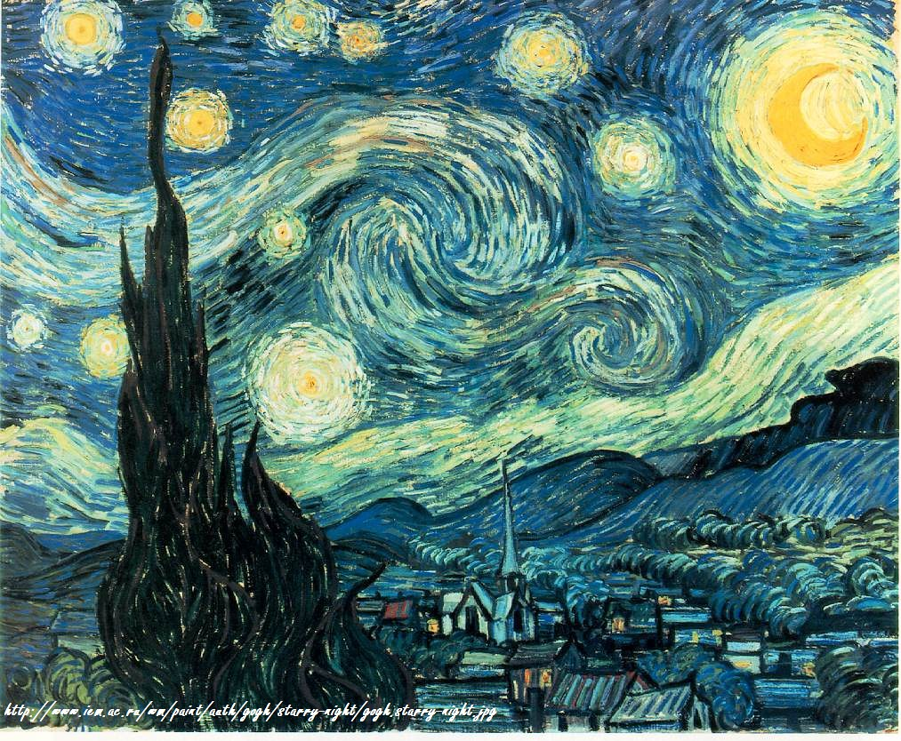
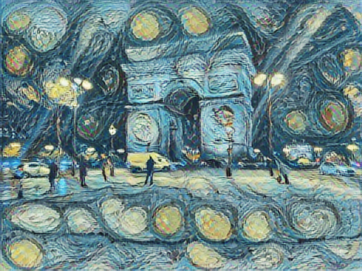

# Style transfer with tensorflow

## Style transfer with existing model on tensorflow hub

### Usage notice :

First clone the repo

```bash
git clone https://github.com/maxencerb/Style_transfer_tensorflow.git
```

Then simply use the function as detailed in the [python notebook](https://github.com/maxencerb/Style_transfer_tensorflow/blob/master/test-fastai-style-transfer-2.ipynb).

```python
from fast_style_transfer import complete_fast_algorithm

content_path = './content_images/champs_elysees.jpg'
style_path = './style_images/starry_night.jpg'

result_image = complete_fast_algorithm(content_path, style_path)

result_image.save('path/to/file.png')
```

### Test result

The content image is :

 

The style image is Starry night by Van Gogh:



And the result is amazing I think :


